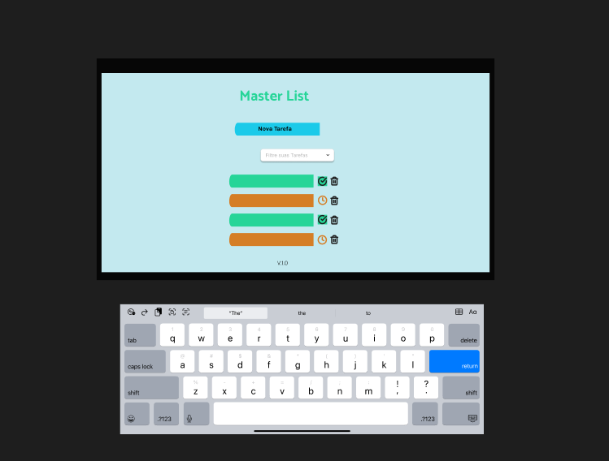
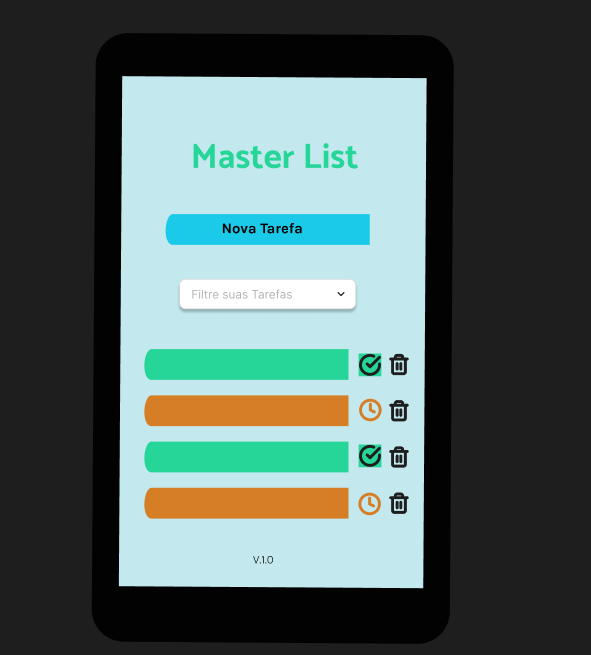

# TO_DO_LIST

* PRINCIPAL PROCESSO DE NEGÓCIO: Organização das tarefas em pendentes e concluídas.

* MODELO DE NEGÓCIO: Freemium. Por 4,99 (quatro reais e noventa e nove centavos) mensais OU 45,00 (quarenta e cinco reais) pela licença vitalícia -  Modalidade gratuita com anúncio.

* PÚBLICO ALVO: usuários que precisam de organização de tarefas.

* REGRAS DE NEGÓCIO: Acesso da funcionalidade em app nas lojas de aplicativos do android e da apple. Sistema com foco em atutoatendimento para organização das próprias tarefas.

* REQUISITOS FUNCIONAIS:
* O app deve criar tarefas.
* Gerenciar as tarefas com função de editar e deletar.
* Fazer filtragem de tarefas classificando-as por: TODAS, CONCLUÍDAS, PENDENTES.
* Ordenar as tarefas por ordem cronológica e status.

* REQUISITOS NÃO FUNCIONAIS: 
* O app deve carregar rapidamente as informações das tarefas. 
* Deve garantir a proteção dos dados do usuário.
* Deve ser compatível com diversos sistemas operacionais 
* Deve ser capaz de lidar com um número crescente de usuários 
* Deve ter interface intuitiva e fácil utilização.

* IDE UTILIZADA: Visual Studio Code.

* CREATORS: Ana Trindade; Estela Kaster; Josué Silva.

PROJETO FIGMA: 

link: https://www.figma.com/design/g057vbRtOJ2qslYRHGUrIw/Untitled?node-id=1-3&t=gFNWRqfIFOTCbxK4-1

